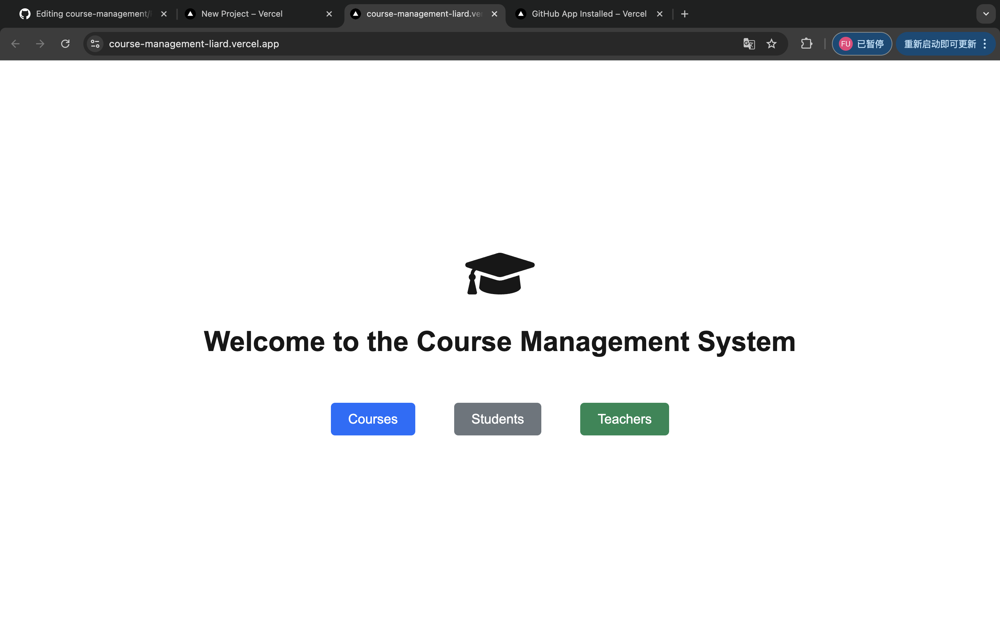
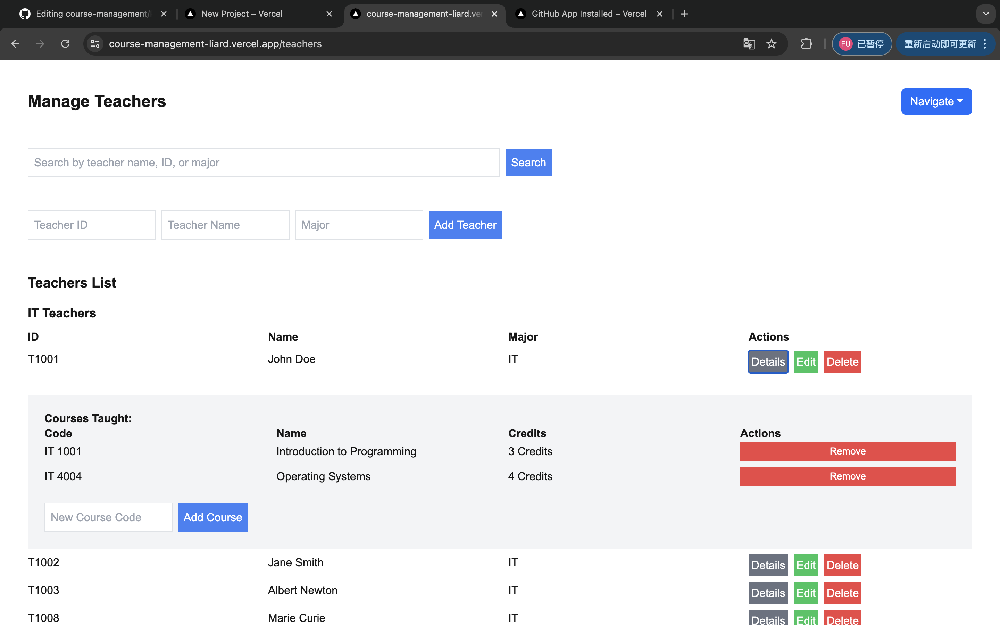

# Member
FU CAO   
YIKAI ZHANG 

# Course Management System

The Online Course Management System provides the university with a comprehensive online platform for students, faculty and administrators to efficiently manage and participate in courses. The system can maintain information about all courses, including course creation, update, and deletion, as well as the course schedule of students and teachers

## Screenshots

